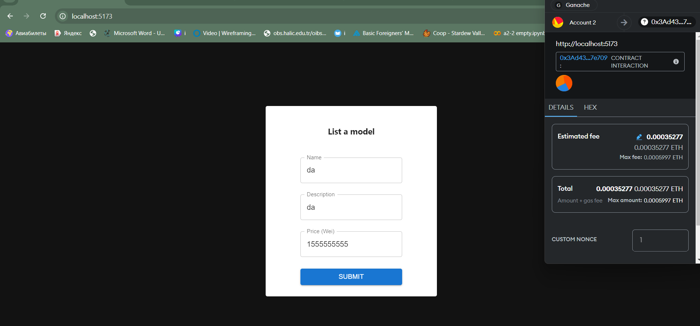
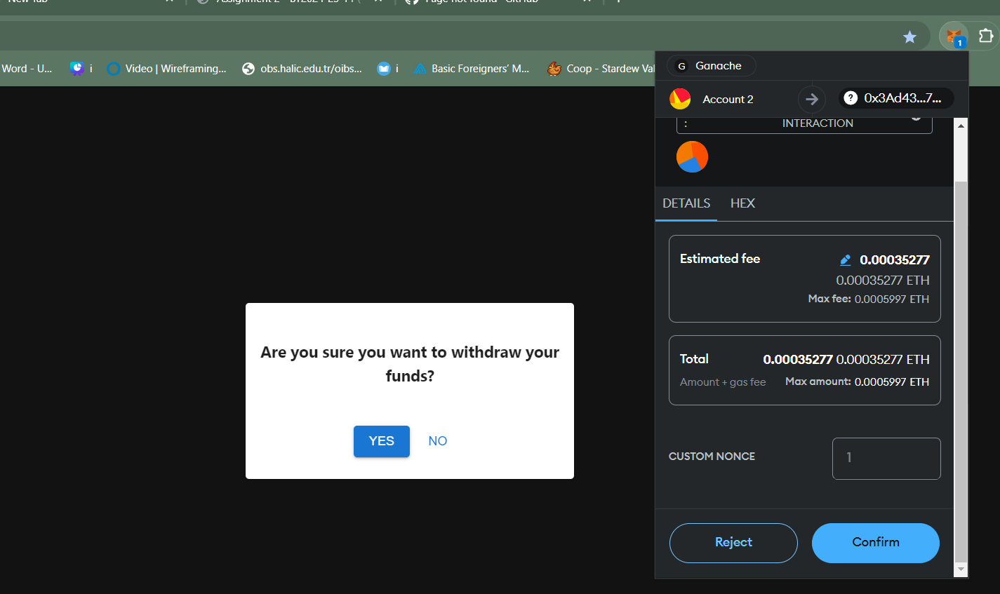
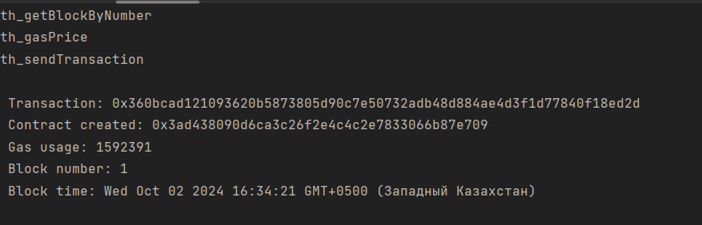

# AI MODEL MARKETPLACE #

This is a simple Web3 application that represents the AI model marketplace.
It is implemented via Solidity smart contract. It has following functions:
* Listing a model;
* Withdrawing funds;
* Purchasing a modules;
* Displaying modules

**Listing a model:**

**Withdrawing funds**

**Contract deploy**
